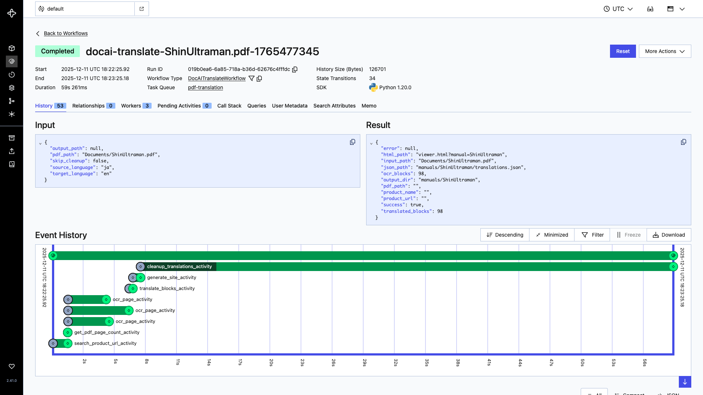
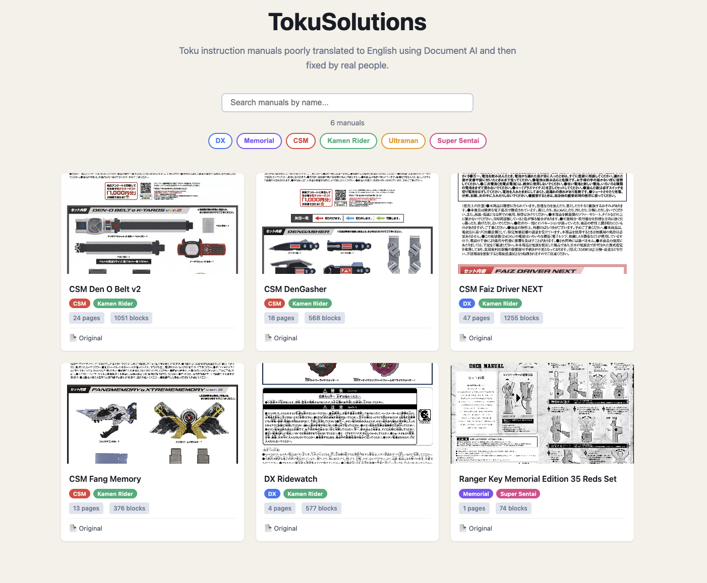
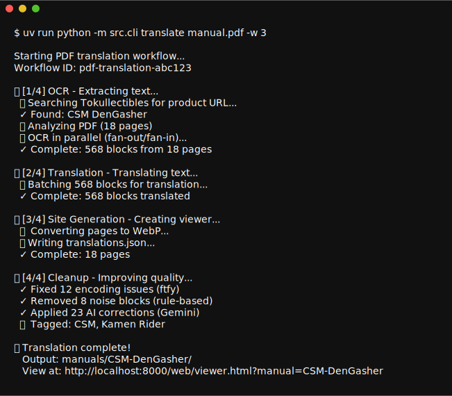
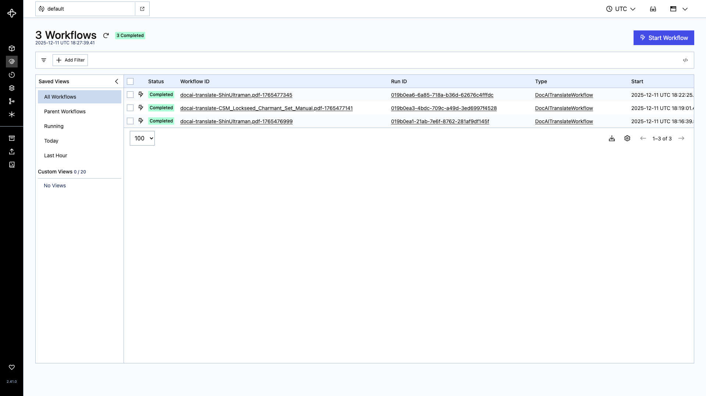

# TokuSolutions: Layout-Preserving PDF Translation with Human-in-the-Loop Editing


I buy a lot of Kamen Rider toys. The problem? All the manuals are in Japanese, and these toys have *a lot* of features.

Google Translate on your phone works for simple text, but PDF translation is terrible—it loses layout context, mangles technical terms, and produces nonsense for complex instructions. This project attempts to do the best possible automated PDF translation while providing an interface for humans to fix the inevitable mistakes AI makes.

**The approach**: Use Google Document AI for OCR with layout detection, batch translate via Google Translate API, clean up with Gemini AI using product context, then present everything in an editable web interface. All orchestrated by Temporal workflows for reliable, parallel execution.

## How Temporal Orchestrates Translation

The system uses a [parent workflow](src/workflows/pdf_translation_workflow.py) that orchestrates four child workflows:

1. **[OCRWorkflow](src/workflows/ocr_workflow.py)** - Extract text from PDF
   - Product search on Tokullectibles
   - Get PDF page count
   - Parallel OCR across all pages (fan-out/fan-in)

2. **[TranslationWorkflow](src/workflows/translation_workflow.py)** - Translate extracted text
   - Batch translation via Google Translate API

3. **[SiteGenerationWorkflow](src/workflows/site_generation_workflow.py)** - Generate web viewer
   - Convert pages to WebP images
   - Create translations.json and viewer HTML

4. **[CleanupWorkflow](src/workflows/cleanup_workflow.py)** - Improve translation quality
   - Stage 1: ftfy - Fix Unicode/OCR corruption (deterministic)
   - Stage 2: Rule-based - Remove noise patterns (deterministic)
   - Stage 3: Gemini AI - Context-aware corrections + tagging (non-deterministic)

**Why child workflows?**
- **Separation in Temporal UI**: Each phase visible as separate workflow execution
- **Independent lifecycle**: Each phase has own event history and retry logic
- **Query support**: Parent workflow exposes real-time progress via Temporal Queries
- **Observability**: Better visibility into which phase is executing or failed

**Real-time Progress Tracking:**

The CLI polls the workflow using Temporal Queries (every 500ms) to display live progress:

```
📄 [1/4] OCR - Extracting text...
  → Starting OCR workflow...
  ✓ Complete: 15 blocks from 5 pages

🌐 [2/4] Translation - Translating text...
  ✓ Complete: 15 blocks

🌍 [3/4] Site Generation - Creating viewer...
  ✓ Complete: 5 pages

✨ [4/4] Cleanup - Improving quality...
  ✓ Fixed 3 encoding issues
  ✓ Removed 2 noise blocks
  ✓ Applied 5 AI corrections
```

The parent workflow updates a `WorkflowProgress` state that includes phase tracking and sub-progress details from each child workflow.

**Why Temporal?**
- **Fan-out/fan-in**: Pages 0-19 all OCR in parallel, results merge when done
- **Automatic retries**: API rate limits and transient failures handled automatically
- **Multi-document processing**: Run multiple workers to process different manuals simultaneously
- **Durable execution**: 50-page documents complete reliably without custom state management

The timeline view shows parallel OCR execution:



## Prerequisites

- Python 3.12+, [uv](https://docs.astral.sh/uv/) 
- [Temporal CLI](https://docs.temporal.io/cli)
- Google Cloud Project with Document AI and Translation API enabled
- Service account credentials JSON
- (Optional) Gemini API key for AI cleanup

## Quick Start

```bash
# Install
uv sync

# Configure
cp .env.example .env
# Edit .env with your credentials

# Start Temporal (Terminal 1)
temporal server start-dev

# Translate (Terminal 2)
uv run python -m src.cli translate path/to/manual.pdf

# View results
python -m http.server 8000  # Open http://localhost:8000/
```

Required `.env`:
```bash
ProjectID=your-gcp-project-id
ProcessorID=your-documentai-processor-id
Location=us
CREDENTIALS_PATH=credentials/service-account.json
GEMINI_API_KEY=your-gemini-api-key  # Optional
```

## Website



The translatations are served to users via a static site hosted on GitHub Pages using front end javascript to render the translations ontop of webp splits of the original manuals. The viewer features an inline editor for fixing translation errors. Click any text block to edit, and changes sync back to the repository via pull request—enabling collaborative review and version control for manual corrections.

Manuals are automatically tagged by product line (CSM, DX, Memorial) and franchise (Kamen Rider, Sentai, Ultraman). With Gemini API key configured, tagging uses AI for higher accuracy; otherwise falls back to pattern matching.

## CLI Commands



```bash
# Translate with multiple workers (process multiple PDFs simultaneously)
uv run python -m src.cli translate manual.pdf -w 5

# Skip AI cleanup
uv run python -m src.cli translate manual.pdf --skip-cleanup

# List manuals
uv run python -m src.cli list

# Add product URL
uv run python -m src.cli add-url "ManualName" "https://..."

# Regenerate index
uv run python -m src.cli reindex
```

## Monitoring



Temporal Web UI at http://localhost:8233 shows workflow execution, retry attempts, and parallel tasks.

## Temporal Best Practices

The workflow implements several Temporal best practices for reliable, scalable execution:

### 1. Retry Policies
Three retry strategies for different operation types:
- **QUICK_RETRY**: Fast operations (file I/O, simple processing) - 3 attempts, 1-10s backoff
- **API_RETRY**: External API calls (Document AI, Translation API) - 5 attempts, 2-30s backoff with exponential growth
- **LLM_RETRY**: AI model calls (Gemini cleanup) - 3 attempts, 5s-2min backoff

### 2. Activity Separation
**Why three separate cleanup activities instead of one?**

Cleanup is split into three distinct activities because Temporal workflows must be deterministic. Each activity serves a specific purpose:

- **ftfy_cleanup_activity** - Deterministic Unicode/encoding fixes
  - Always produces same output for same input
  - Fast retry (1-10s backoff, 3 attempts)
  - No heartbeats needed

- **rule_based_cleanup_activity** - Deterministic pattern-based removal
  - Regex patterns always match consistently
  - Fast retry (1-10s backoff, 3 attempts)
  - No heartbeats needed

- **gemini_cleanup_activity** - Non-deterministic AI corrections + tagging
  - LLM responses vary between calls
  - Longer retry (5s-2min backoff, 3 attempts)
  - Heartbeats before/after LLM call (2min timeout)
  - Pydantic validation for type safety
  - Can fail without breaking the workflow

**Benefits of separation:**
- **Independent failure**: Gemini can fail, manual still gets ftfy+rule cleanup
- **Different retry policies**: APIs need longer timeouts than deterministic operations
- **Observability**: Each stage visible separately in Temporal Web UI
- **Workflow determinism**: Non-deterministic operations isolated in activities

### 3. Heartbeats
Long-running activities send heartbeats to prevent timeouts:
- Site generation: Heartbeat every 5 pages during image rendering
- Gemini cleanup: Heartbeats before/after LLM API calls (2min timeout)

### 4. Workflow Determinism
Non-deterministic operations moved outside workflows:
- `Path` operations (stem, name extraction) moved to CLI layer
- Manual name and output directory computed before workflow starts
- Only deterministic data transformations in workflow code

## Type-Safe AI with Pydantic + Temporal

LLM responses are unpredictable. Combining [Pydantic](https://docs.pydantic.dev) validation with Temporal's retry logic ensures the AI cleanup is both safe and reliable.

**Three-stage cleanup pipeline:**
1. **ftfy** - Fix Unicode encoding and OCR corruption
2. **Rule-based** - Remove page numbers, symbols, artifacts
3. **Gemini AI** - Context-aware corrections with product metadata

**Pydantic validation** ([cleanup.py](src/cleanup.py#L13-L26)) enforces the response schema:
```python
class GeminiCleanupResponse(BaseModel):
    remove: list[str]           # Block indices to remove
    corrections: dict[str, str] # Index → corrected text
    product_name: str           # Official product name
```

**How it works:**
- Gemini returns JSON → Pydantic validates structure and types
- Invalid responses trigger Temporal activity retry (with exponential backoff)
- Activities can't return malformed data to the workflow
- Type safety across the entire pipeline from OCR → AI → storage

This pattern prevents corrupt data from reaching `translations.json` while leveraging Temporal's built-in retry logic for transient failures.

## Performance

Typical 20-page manual: ~50 seconds with single worker
- 30s OCR (parallel across pages)
- 5s translation (batch)
- 10s AI cleanup
- 5s site generation


## License

MIT
