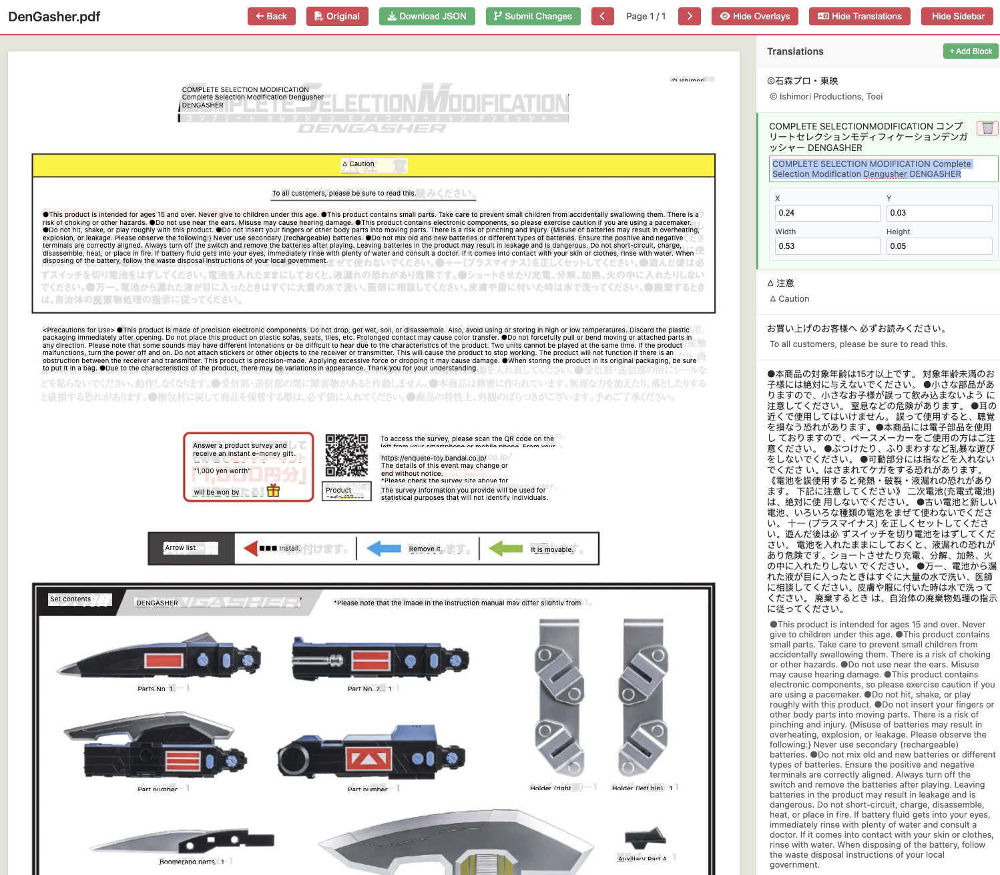
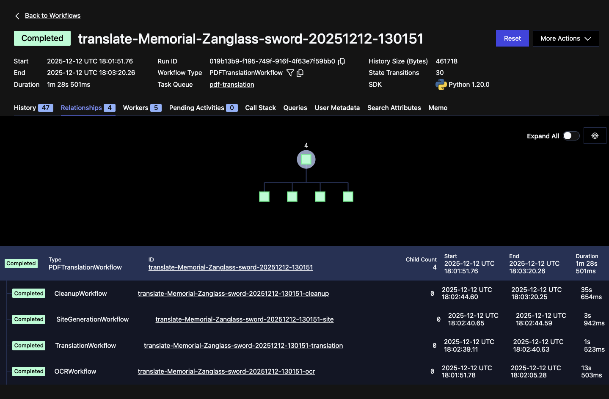
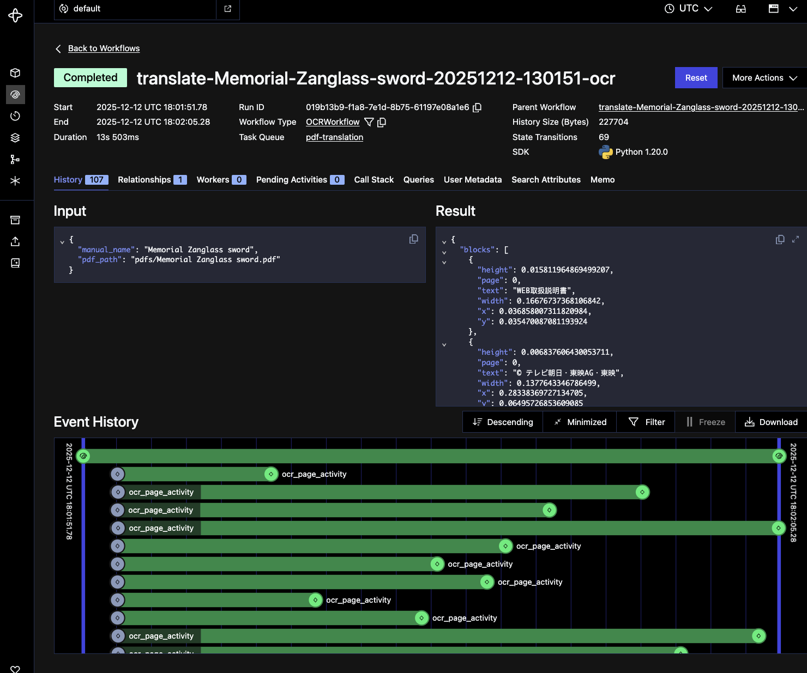

# TokuSolutions: Translating Toy Manuals (AI Tries, You Fix, Temporal Orchestrates)


I buy a lot of Kamen Rider toys. The problem? All the manuals are in Japanese, and these toys have *a lot* of features.

Google Translate on your phone works for simple text, but PDF translation is terrible—it loses layout context, mangles technical terms, and produces nonsense for complex instructions. This project uses Google Document AI for OCR with layout detection, batch translate via Google Translate API, clean up with Gemini AI using product context, then presents everything in an editable web interface. All orchestrated by Temporal workflows for reliable, parallel execution.

## Quick Start

**Prerequisites:**
- Python 3.12+, [uv](https://docs.astral.sh/uv/)
- [Temporal CLI](https://docs.temporal.io/cli)
- Google Cloud Project with Document AI and Translation API enabled
- Service account credentials JSON
- (Optional) Gemini API key for AI cleanup

```bash
# Install
uv sync

# Configure
cp .env.example .env
# Edit .env with your credentials

# Start Temporal (Terminal 1)
temporal server start-dev

# Translate (Terminal 2)
uv run python -m src.cli translate path/to/manual.pdf

# View results
python -m http.server 8000  # Open http://localhost:8000/
```

Required `.env`:
```bash
ProjectID=your-gcp-project-id
ProcessorID=your-documentai-processor-id
Location=us
CREDENTIALS_PATH=credentials/service-account.json
GEMINI_API_KEY=your-gemini-api-key  # Optional
```

## What You Get

**Web Viewer** with search, tag filtering, and inline editing:

<p align="center">
  
  
</p>

- **Click any text block** to edit original text, translation, or bounding box coordinates
- **Export changes** as JSON or submit via GitHub pull request for collaborative review
- **Auto-tagging** by product line (CSM, DX, Memorial) and franchise (Kamen Rider, Sentai, Ultraman)
- **Product links** to Tokullectibles store and translated Bandai blog posts

## CLI Commands


```bash
# Basic translation
uv run python -m src.cli translate manual.pdf

# Translate with multiple workers (process multiple PDFs simultaneously)
uv run python -m src.cli translate manual.pdf -w 5

# Skip AI cleanup (faster, but less accurate)
uv run python -m src.cli translate manual.pdf --skip-cleanup

# List manuals
uv run python -m src.cli list

# Add product URL
uv run python -m src.cli add-url "ManualName" "https://..."

# Regenerate index
uv run python -m src.cli reindex
```

## Development Workflow

For faster iteration when processing multiple manuals, run a persistent worker:

```bash
# Terminal 1: Temporal server
temporal server start-dev

# Terminal 2: Persistent worker
uv run python -m src.worker

# Terminal 3: Translate (no 2-second worker startup delay)
uv run python -m src.cli translate manual.pdf
```

The default `translate` command auto-starts workers for convenience, but this approach eliminates the startup delay.

**Monitoring:** Temporal Web UI at http://localhost:8233 shows workflow execution, retry attempts, and parallel tasks.

## How Temporal Orchestrates Translation

The system uses a [parent workflow](src/workflows/pdf_translation_workflow.py) that orchestrates four child workflows:

1. **[OCRWorkflow](src/workflows/ocr_workflow.py)** - Extract text from PDF
   - Product search on Tokullectibles
   - Get PDF page count
   - **Fan-out/fan-in**: Parallel OCR across all pages (0-N simultaneously)

2. **[TranslationWorkflow](src/workflows/translation_workflow.py)** - Translate extracted text
   - Batch translation via Google Translate API

3. **[SiteGenerationWorkflow](src/workflows/site_generation_workflow.py)** - Generate web viewer
   - Convert pages to WebP images
   - Create translations.json and viewer HTML
   - Heartbeats every 5 pages (long-running activity)

4. **[CleanupWorkflow](src/workflows/cleanup_workflow.py)** - Improve translation quality
   - **Stage 1**: ftfy - Fix Unicode/OCR corruption (deterministic)
   - **Stage 2**: Rule-based - Remove noise patterns (deterministic)
   - **Stage 3**: Gemini AI - Context-aware corrections + tagging (non-deterministic)

<p align="center">
  
  
</p>

**Why child workflows?**
- **Separation in Temporal UI**: Each phase visible as separate workflow execution
- **Independent lifecycle**: Each phase has own event history and retry logic
- **Query support**: Parent workflow exposes real-time progress via Temporal Queries
- **Observability**: Better visibility into which phase is executing or failed

### Real-time Progress Tracking

The CLI polls the workflow using Temporal Queries (every 500ms) to display live progress:

```
📄 [1/4] OCR - Extracting text...
  ✓ Complete: 15 blocks from 5 pages
🌐 [2/4] Translation - Translating text...
  ✓ Complete: 15 blocks
🌍 [3/4] Site Generation - Creating viewer...
  ✓ Complete: 5 pages
✨ [4/4] Cleanup - Improving quality...
  ✓ Fixed 3 encoding issues
  ✓ Removed 2 noise blocks
  ✓ Applied 5 AI corrections
```

The parent workflow updates a `WorkflowProgress` state that includes phase tracking and sub-progress details from each child workflow.

### Temporal Best Practices Demonstrated

**1. Retry Policies** - Three strategies tuned for operation types:
- **QUICK_RETRY**: Fast operations (file I/O) - 3 attempts, 1-10s backoff
- **API_RETRY**: External APIs (Document AI, Translation) - 5 attempts, 2-30s backoff
- **LLM_RETRY**: AI model calls (Gemini) - 3 attempts, 5s-2min backoff

**2. Activity Separation for Determinism**

Why three separate cleanup activities instead of one? Temporal workflows must be deterministic:

- **ftfy_cleanup_activity** - Deterministic Unicode fixes (always same output for same input)
- **rule_based_cleanup_activity** - Deterministic pattern removal (regex patterns)
- **gemini_cleanup_activity** - Non-deterministic AI corrections (LLM responses vary)

Benefits: Gemini can fail without breaking the workflow, different retry policies per operation type, each stage visible in Temporal UI.

**3. Heartbeats** - Long-running activities send heartbeats to prevent timeouts:
- Site generation: Every 5 pages during image rendering
- Gemini cleanup: Before/after LLM API calls (2min timeout)

**4. Workflow Determinism** - Non-deterministic operations moved outside workflows:
- `Path` operations (stem, name extraction) moved to CLI layer
- Manual name and output directory computed before workflow starts
- Only deterministic data transformations in workflow code

**5. Type-Safe AI with Pydantic** - LLM responses validated before reaching workflow:

```python
class GeminiCleanupResponse(BaseModel):
    remove: list[str]           # Block indices to remove
    corrections: dict[str, str] # Index → corrected text
    product_name: str           # Official product name
```

Gemini returns JSON → Pydantic validates structure → Invalid responses trigger Temporal activity retry → Type safety across entire pipeline.

### Performance

Typical 20-page manual: ~50 seconds with single worker
- 30s OCR (parallel across pages)
- 5s translation (batch)
- 10s AI cleanup
- 5s site generation

## License

MIT
