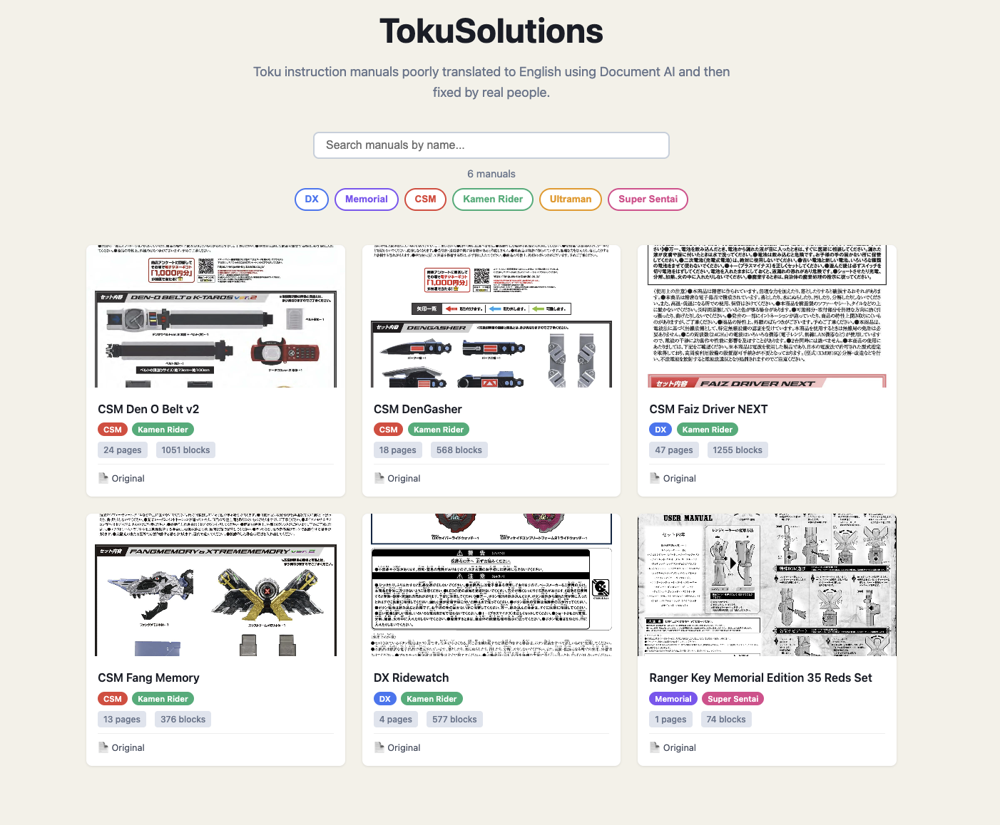
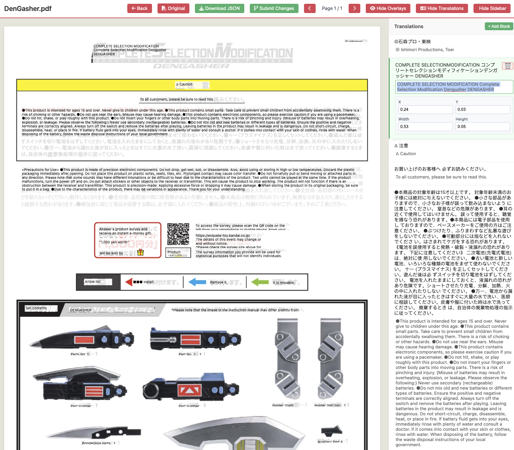
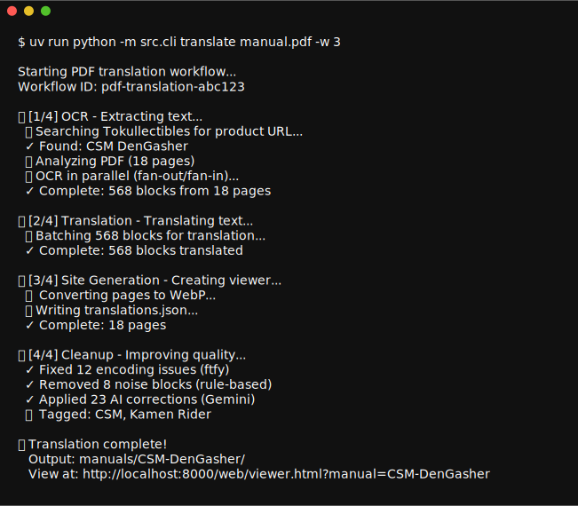
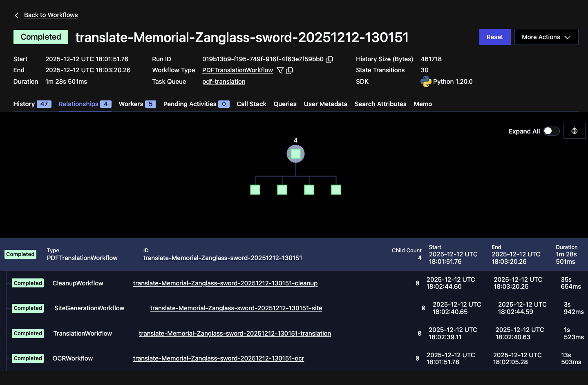
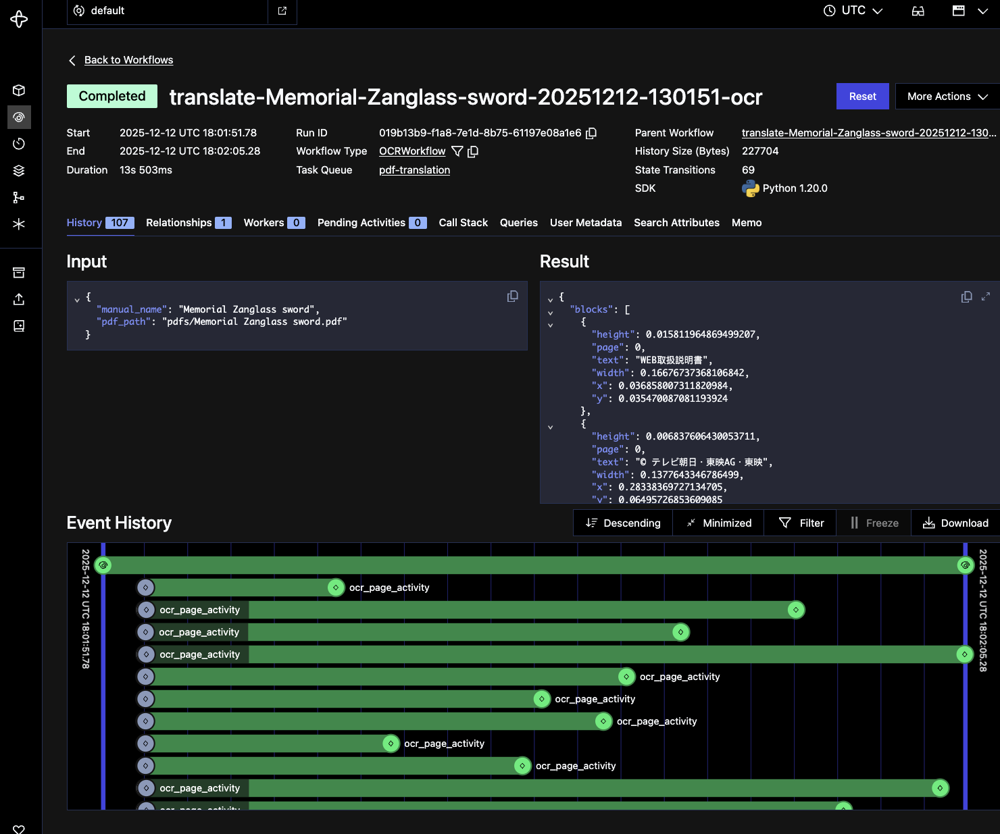

# TokuSolutions: OCR Translation with Temporal Workflows

Japanese toy manual translator demonstrating Temporal workflow patterns. Extracts text from PDFs using Google Document AI, translates to English, and generates an interactive web viewer.

<p align="center">
  <a href="https://www.youtube.com/watch?v=C_fE8T-DwiU">
    
    <br/>
    
  </a>
</p>

## What You'll Learn

**Temporal workflow concepts:**
- Parent/child workflow orchestration
- Fan-out/fan-in parallel execution
- Activity retry policies tuned by operation type
- Workflow queries for real-time progress
- Deterministic workflow design
- Activity heartbeats for long operations

**Practical application:**
- Batch OCR processing with Google Document AI
- Translation API integration
- LLM-powered cleanup with structured validation
- Interactive web viewer with inline editing

## What It Does

Translates Japanese toy instruction manuals to English. I collect Kamen Rider transformation devices—all documentation is in Japanese. This automates translation while preserving layout context that phone-based translation loses.

## Quick Start

**Prerequisites:**
- Python 3.12+, [uv](https://docs.astral.sh/uv/)
- [Temporal CLI](https://docs.temporal.io/cli)
- Google Cloud Project with Document AI and Translation API enabled
- Service account credentials JSON
- (Optional) Gemini API key for AI cleanup

```bash
# Install
uv sync

# Configure
cp .env.example .env
# Edit .env with your credentials

# Start Temporal (Terminal 1)
temporal server start-dev

# Translate (Terminal 2)
uv run python -m src.cli translate path/to/manual.pdf
```

Required [.env](.env.example):
```bash
ProjectID=your-gcp-project-id
ProcessorID=your-documentai-processor-id
Location=us
CREDENTIALS_PATH=credentials/service-account.json
GEMINI_API_KEY=your-gemini-api-key  # Optional
```

## Web Viewer

Search, filter, and edit translations inline:

<p align="center">
  
  
</p>

- Click any text block to edit original text, translation, or bounding box
- Export changes as JSON or submit via GitHub PR
- Auto-tagging by product line (CSM, DX, Memorial) and franchise (Kamen Rider, Sentai, Ultraman)
- Product links to Tokullectibles store and translated Bandai blog posts

## CLI Commands



```bash
# Basic translation
uv run python -m src.cli translate manual.pdf

# Multiple workers (parallel processing)
uv run python -m src.cli translate manual.pdf -w 5

# Skip AI cleanup (faster, less accurate)
uv run python -m src.cli translate manual.pdf --skip-cleanup

# Provide product URL directly (skips search)
uv run python -m src.cli translate manual.pdf --product-url "https://tokullectibles.com/products/..."

# List manuals
uv run python -m src.cli list

# Add product URL to existing manual
uv run python -m src.cli add-url "ManualName" "https://..."

# Regenerate index
uv run python -m src.cli reindex
```

## Development Workflow

Run a persistent worker to eliminate startup delay:

```bash
# Terminal 1: Temporal server
temporal server start-dev

# Terminal 2: Persistent worker
uv run python -m src.worker

# Terminal 3: Translate (instant start)
uv run python -m src.cli translate manual.pdf
```

**Monitoring:** Temporal Web UI at [http://localhost:8233](http://localhost:8233) shows workflow execution, retry attempts, and parallel tasks.

## How Temporal Orchestrates Translation

Parent workflow ([pdf_translation_workflow.py](src/workflows/pdf_translation_workflow.py)) orchestrates four child workflows:

**1. [OCRWorkflow](src/workflows/ocr_workflow.py)** - Extract text from PDF
- Product search on Tokullectibles
- Get PDF page count
- **Fan-out/fan-in**: Parallel OCR across all pages (0-N simultaneously)

**2. [TranslationWorkflow](src/workflows/translation_workflow.py)** - Translate extracted text
- Batch translation via Google Translate API

**3. [SiteGenerationWorkflow](src/workflows/site_generation_workflow.py)** - Generate web viewer
- Convert pages to WebP images
- Create translations.json and viewer HTML
- Heartbeats every 5 pages (long-running activity)

**4. [CleanupWorkflow](src/workflows/cleanup_workflow.py)** - Improve translation quality
- **Stage 1**: ftfy - Fix Unicode/OCR corruption (deterministic)
- **Stage 2**: Rule-based - Remove noise patterns (deterministic)
- **Stage 3**: Gemini AI - Context-aware corrections + tagging (non-deterministic)

<p align="center">
  
  
</p>

**Why child workflows?**
- Separation in Temporal UI - each phase visible as distinct workflow execution
- Independent lifecycle - each phase has own event history and retry logic
- Query support - parent workflow exposes real-time progress
- Observability - better visibility into which phase is executing or failed

### Real-time Progress Tracking

CLI polls workflow using Temporal Queries (every 500ms) to display live progress:

```
📄 [1/4] OCR - Extracting text...
  ✓ Complete: 15 blocks from 5 pages
🌐 [2/4] Translation - Translating text...
  ✓ Complete: 15 blocks
🌍 [3/4] Site Generation - Creating viewer...
  ✓ Complete: 5 pages
✨ [4/4] Cleanup - Improving quality...
  ✓ Fixed 3 encoding issues
  ✓ Removed 2 noise blocks
  ✓ Applied 5 AI corrections
```

Parent workflow updates `WorkflowProgress` state with phase tracking and sub-progress from each child workflow.

### Temporal Best Practices

**1. Retry Policies** - Three strategies tuned for operation types:
- **QUICK_RETRY**: Fast operations (file I/O) - 3 attempts, 1-10s backoff
- **API_RETRY**: External APIs (Document AI, Translation) - 5 attempts, 2-30s backoff
- **LLM_RETRY**: AI model calls (Gemini) - 3 attempts, 5s-2min backoff

**2. Activity Separation for Determinism**

Why three cleanup activities instead of one? Temporal workflows must be deterministic:

- **ftfy_cleanup_activity** - Deterministic Unicode fixes (always same output)
- **rule_based_cleanup_activity** - Deterministic pattern removal (regex patterns)
- **gemini_cleanup_activity** - Non-deterministic AI corrections (LLM responses vary)

Benefits: Gemini can fail without breaking workflow, different retry policies per operation type, each stage visible in Temporal UI.

**3. Heartbeats** - Long-running activities send heartbeats to prevent timeouts:
- Site generation: Every 5 pages during image rendering
- Gemini cleanup: Before/after LLM API calls (2min timeout)

**4. Workflow Determinism** - Non-deterministic operations moved outside workflows:
- `Path` operations (stem, name extraction) moved to CLI layer
- Manual name and output directory computed before workflow starts
- Only deterministic data transformations in workflow code

**5. Type-Safe AI with Pydantic** - LLM responses validated before reaching workflow:

```python
class GeminiCleanupResponse(BaseModel):
    remove: list[str]           # Block indices to remove
    corrections: dict[str, str] # Index → corrected text
    product_name: str           # Official product name
```

Gemini returns JSON → Pydantic validates structure → Invalid responses trigger Temporal activity retry → Type safety across entire pipeline.

## Key Files

- [src/cli.py](src/cli.py) - CLI interface with auto-managed workers
- [src/worker.py](src/worker.py) - Persistent Temporal worker
- [src/workflows/](src/workflows/) - All workflow definitions
- [src/activities/](src/activities/) - OCR, translation, site generation, cleanup activities
- [src/cleanup.py](src/cleanup.py) - Three-stage cleanup pipeline (ftfy → rules → LLM)
- [src/tokullectibles.py](src/tokullectibles.py) - Product search and metadata retrieval
- [src/tagging.py](src/tagging.py) - Auto-tagging system (Gemini + regex fallback)

## Performance & Cost

**Typical 20-page manual:**
- Time: ~50 seconds with single worker (30s OCR parallel, 5s translation, 10s AI cleanup, 5s site generation)
- Cost: ~$0.43 (Document AI $0.03 + Translation API $0.40 + Gemini free)

**Cost estimates** (December 2024 pricing):
- Small (5 pages): ~$0.11
- Medium (20 pages): ~$0.43
- Large (50 pages): ~$1.08

Gemini 1.5 Flash is free tier (15 RPM, 1M TPM, 1500 RPD) - sufficient for hobby use.

## License

MIT
